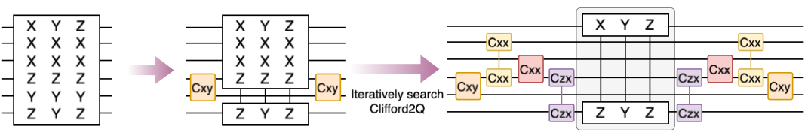

# 🐦‍🔥 PHOENIX: Pauli-based High-level Optimization ENgine for Instruction eXecution on NISQ Devices

[](https://pypi.org/project/phoenix-quantum/)
[](https://pypi.org/project/phoenix-quantum/)
[](./LICENSE)
[](https://github.com/iqubit-org/phoenix/actions/workflows/ci.yml)
[](https://fact-lab.hkust.edu.hk/publications/conference-paper/2025/yang-2025-phoenix/Phoenix-ZY%20%2862DAC_Presentation%29.pdf)
[](https://arxiv.org/abs/2504.03529)


## Overview

Phoenix is a high-level VQA (variational quantum algorithm) compiler built on top of [Qiskit](https://github.com/Qiskit/qiskit). It compiles Hamiltonian simulation circuits by exploiting global optimization opportunities through the BSF (binary symplectic form) representation of Pauli exponentiations and Clifford formalism.

Different from ZX-calculus-like approaches (e.g., [TKet](https://github.com/CQCL/pytket-docs), [PauliOpt](https://github.com/hashberg-io/pauliopt)) and local peephole optimization approaches (e.g., [Paulihedral](https://arxiv.org/abs/2109.03371), [Tetris](https://arxiv.org/abs/2309.01905v2)), Phoenix performs global optimization on the Pauli-string IR level before lowering to gate-level circuits.

This repo includes benchmarking scripts and results with other SOTA baselines -- TKet, Paulihedral, Tetris, PauliOpt, and QuCLEAR. Code of Paulihedral and Tetris are refactored and integrated in this repo.


## Usage

```python
import phoenix

ham = phoenix.Hamiltonian(['XXIII', 'YYIII', 'ZZIII'], [0.5, 0.5, 0.5])
qc = phoenix.compile_hamiltonian_simulation(ham)
phoenix.utils.print_circ_info(qc)
```

*Also, see [examples/phoenix_pass.py](examples/phoenix_pass.py) for reference.*

The compiler pipeline:

1. **Grouping** -- group Pauli terms by their non-trivial support
2. **Simplification** -- simplify each group via Clifford conjugation in binary symplectic form
3. **Circuit construction** -- convert simplified configurations into `QuantumCircuit` blocks
4. **Ordering** -- schedule blocks to minimize depth overhead and maximize gate cancellation (TSP-based or greedy)
5. **Post-optimization** -- apply Qiskit transpiler passes for Clifford cancellation and unitary resynthesis

Key parameters of `compile_hamiltonian_simulation`:

| Parameter | Default | Description |
|-----------|---------|-------------|
| `grouping` | `True` | Group Pauli terms by non-trivial support before simplification |
| `optimize` | `True` | Apply Qiskit post-optimization |
| `parallel_search` | `False` | Perform Clifford search in parallel or sequentially on each BSF |
| `order_method` | `None` (=`'tsp'`) | Block ordering: `'trivial'`, `'greedy'`, or `'tsp'` |
| `backend` | `'sequential'` | Parallelization: `'sequential'`, `'concurrent.futures'`, or `'joblib'` |


## Illustration

Core optimization strategy (BSF simplification via Clifford conjugation):




## Benchmarking Results

### UCCSD Benchmarks (18 molecule simulation programs, 3 device topologies)

```
>>> Num2Q Opt Rate
+----------------+--------+-------+-------------+--------+----------+---------+---------+
| Num2Q Opt Rate | Qiskit |  TKet | Paulihedral | Tetris | PauliOpt | QuCLEAR | Phoenix |
+----------------+--------+-------+-------------+--------+----------+---------+---------+
|    All2all     | 0.177  | 0.126 |    0.317    | 0.556  |  0.426   |   0.16  |  0.191  |
|   All2all O3   | 0.175  | 0.125 |    0.292    | 0.388  |  0.426   |  0.158  |  0.191  |
|     Square     | 0.505  | 0.307 |    0.459    | 0.618  |  0.903   |  0.393  |  0.422  |
|      HHex      |  0.86  | 0.479 |    0.839    | 0.676  |  1.461   |  0.603  |  0.589  |
+----------------+--------+-------+-------------+--------+----------+---------+---------+

>>> Depth2Q Opt Rate
+------------------+--------+-------+-------------+--------+----------+---------+---------+
| Depth2Q Opt Rate | Qiskit |  TKet | Paulihedral | Tetris | PauliOpt | QuCLEAR | Phoenix |
+------------------+--------+-------+-------------+--------+----------+---------+---------+
|     All2all      | 0.124  | 0.075 |    0.321    | 0.549  |  0.236   |  0.104  |  0.164  |
|    All2all O3    | 0.122  | 0.074 |    0.296    | 0.381  |  0.236   |  0.102  |  0.164  |
|      Square      | 0.344  | 0.214 |     0.4     | 0.501  |   0.57   |  0.276  |   0.34  |
|       HHex       | 0.522  | 0.305 |    0.698    | 0.531  |  0.861   |  0.393  |  0.437  |
+------------------+--------+-------+-------------+--------+----------+---------+---------+
```

Lower is better. Opt Rate = geometric mean of (optimized / original) across all benchmarks.

### HamLib Benchmarks (100 programs across 4 categories)

```
>>> Num2Q Opt Rate
+---------------------------+--------+-------+-------------+--------+---------+---------+
|       Num2Q Opt Rate      | Qiskit |  TKet | Paulihedral | Tetris | QuCLEAR | Phoenix |
+---------------------------+--------+-------+-------------+--------+---------+---------+
|  binaryoptimization (15)  | 1.252  | 0.886 |    0.669    | 0.715  |  1.598  |  0.718  |
| discreteoptimization (15) | 0.542  | 0.556 |    0.524    | 0.751  |  0.578  |  0.749  |
|       chemistry (35)      | 0.292  | 0.276 |    0.346    | 0.496  |  0.354  |  0.334  |
|    condensedmatter (35)   | 1.084  | 0.855 |    0.527    | 0.678  |  0.758  |  0.498  |
|         All (100)         |  0.63  | 0.542 |     0.47    | 0.622  |  0.611  |  0.486  |
+---------------------------+--------+-------+-------------+--------+---------+---------+

>>> Depth2Q Opt Rate
+---------------------------+--------+-------+-------------+--------+---------+---------+
|      Depth2Q Opt Rate     | Qiskit |  TKet | Paulihedral | Tetris | QuCLEAR | Phoenix |
+---------------------------+--------+-------+-------------+--------+---------+---------+
|  binaryoptimization (15)  | 1.257  | 0.617 |    0.304    | 0.521  |  1.578  |  0.212  |
| discreteoptimization (15) | 0.588  | 0.346 |    0.408    | 1.707  |  0.631  |  0.296  |
|       chemistry (35)      |  0.21  | 0.175 |     0.34    | 0.382  |  0.262  |  0.231  |
|    condensedmatter (35)   | 0.345  | 0.772 |    0.614    | 0.118  |  0.615  |  0.046  |
|         All (100)         | 0.381  | 0.394 |    0.421    | 0.332  |  0.517  |  0.134  |
+---------------------------+--------+-------+-------------+--------+---------+---------+

```


## Installation


### 1. From PyPI

```bash
pip install phoenix-quantum
```


### 2. From Source

```bash
pip install .
```

or for development:

```bash
pip install -e .
```


## Requirements

Core dependencies (automatically installed):

- `qiskit >= 1.0.0`
- `numpy >= 1.21.0`
- `scipy >= 1.7.0`
- `matplotlib >= 3.0.0`


## Benchmarking Scripts

All benchmarking scripts are under [`./experiments/`](./experiments/).

| Script | Description |
|--------|-------------|
| `bench_single.py` | Run a single benchmark given a compiler and input JSON file |
| `bench_uccsd.py` | Batch benchmark on UCCSD suite for a given compiler |
| `bench_hamlib.py` | Batch benchmark on HamLib suite for a given compiler and category |
| `bench_utils.py` | Standard compilation passes for Phoenix and all baselines |
| `uccsd_all2all_to_limited.py` | Map all-to-all results to limited-connectivity topologies (square, heavy-hex) |
| `uccsd_all2all_qiskit_opt.py` | Apply Qiskit O3 post-optimization to logical-level synthesis results |

Use `make` targets for batch execution across UCCSB benchmark suite while use `make -f Makefile-Hamlib` for HamLib benchmarking:

For example,
```bash
cd experiments
make phoenix          # Run Phoenix on UCCSD (all2all)
make phoenix_square   # Map Phoenix results to square topology
make sum_result       # Summarize all results to CSV
make disp_result      # Display comparison tables
```

## Citation

If you make use of Phoenix in your work, please cite the following publication:

```
@inproceedings{yang2025phoenix,
  author={Yang, Zhaohui and Ding, Dawei and Zhu, Chenghong and Chen, Jianxin and Xie, Yuan},
  booktitle={2025 62nd ACM/IEEE Design Automation Conference (DAC)}, 
  title={PHOENIX: Pauli-Based High-Level Optimization Engine for Instruction Execution on NISQ Devices}, 
  year={2025},
  volume={},
  number={},
  pages={1-7},
  doi={10.1109/DAC63849.2025.11133028}
}
```

## License

This project is licensed under the Apache License 2.0 -- see the [LICENSE](LICENSE) file for details.
