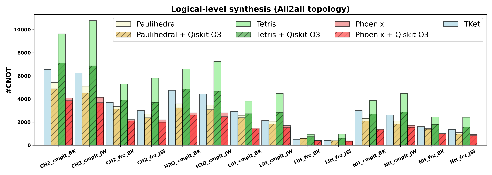
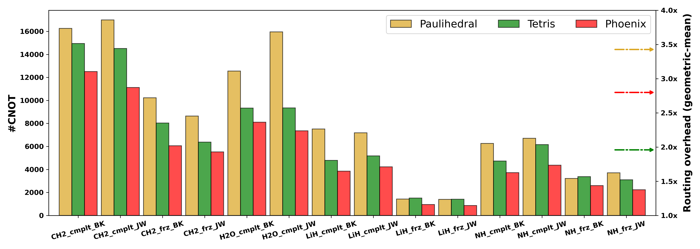

# 🐦‍🔥 𝑷𝑯𝑶𝑬𝑵𝑰𝑿: Pauli-based High-level Optimization ENgine for Instruction eXecution on NISQ Devices

[](./LICENSE) []()   [](https://arxiv.org/abs/2504.03529)


<!-- [](https://arxiv.org/abs/2504.03529) -->


## Overview

Phoenix is a highly-effective VQA (variational quantum algorithm) application-specifc compiler based on BSF (binary symplectic form) of Pauli exponentiations and Clifford formalism. Different from ZX-calculus-like approaches (e.g., [TKet](https://github.com/CQCL/pytket-docs), [PauliOpt](https://github.com/hashberg-io/pauliopt)) and local peephole optimization approaches (e.g., [Paulihedral](https://arxiv.org/abs/2109.03371), [Tetris](https://arxiv.org/abs/2309.01905v2)), Phoenix exploits global optimization opportunities for VQA programs to the largest extent, when representing Pauli strings as BSF and employing Clifford formalism on the higher-level IR.

This repo includes benchmarking scripts and results with other SOTA baselines -- TKet, Paulihedral, Tetris, and Rustiq. Code of Paulihedral and Tetris are refactored and integrated in this repo.

If you make sure of Phoenix in your work, please cite the following publication:

```
@inproceedings{yang2025phoenix,
  author={Yang, Zhaohui and Ding, Dawei and Zhu, Chenghong and Chen, Jianxin and Xie, Yuan},
  booktitle={2025 62nd ACM/IEEE Design Automation Conference (DAC)}, 
  title={PHOENIX: Pauli-Based High-Level Optimization Engine for Instruction Execution on NISQ Devices}, 
  year={2025},
  volume={},
  number={},
  pages={1-7},
  doi={10.1109/DAC63849.2025.11133028}
}
```

## Features

- High-level compilation
- Global optimization
- ISA-independent


**E.g., Illustration of the core optimization strategy**


**E.g., Hardware-agnostic compilation:**



**E.g., Hardware-aware compilation:**




## Requirements

Basic library requirements are lists in `requirements.txt`.

- We align with the `1.2.4` version of  `qiskit`  across the published benchmarking results, since `qiskit`'s O1/O2 has different built-in workflows within its 0.xx.x versions and 1.xx.x versions. Version 1.0+ is suitable for Phoenix.
- Originally, Paulihedral and Tetris require version 0.23.x and version 0.43.x of Qiskit. In this code repo, they can also be soomthly tested under Qiskit-1.2.4.

## Benchmarking description

**Benchmark suites:**

- UCCSD: 16 molecule simulation programs from benchmarks from [TKet benchmarking](https://github.com/CQCL/tket_benchmarking). We use this suite for fine-grain benchmarking and real system analysis.

**Benchmarking scripts:** (under [./artifact_dac25/experiments/](./artifact_dac25/experiments/))

- `bench_single.py`: Benchmarking given a compiler and input file (`.qasm` file for TKet, `.json` file for Paulihedral/Tetris/Phoenix)
- `bench_hamlib.py`: Benchmarking given a compiler and a category of Hamlib benchmarks
- `bench_uccsd.py`: Benchmarking given a compiler and a physical-qubit topology type (E.g., all2all, manhattan, sycamore) (Since TKet/Phoenix does no make hardware-ware co-optimization, manually set topology execept "all2all" are invalid. Instead, the hardware-ware compilation are conducted by executing another script `uccsd_all2all_to_limited.py`)
- `bench_utils.py`: Utils used in benchmarking, within which the standard compilation passes of Phoenix and baselines are specified
- `uccsd_all2lall_to_limited.py`: Compile all-to-all compilation results from TKet/Phoenix for UCCSD benchmarks to limited-connectivity topology (manhattan, sycamore)
- `uccsd_all2all_qiskit_opt.py`: Further perform Qiskit O3 for logical-level synthesis results of Paulihedral/Tetris/Phoenix

**Result files:**

- `./artifact_dac25/experiments/output_uccsd/<compiler>/<device>`: Output circuits by some `<compiler>` (E.g., Tetris, Phoenix) for some kind of `<device>` (E.g.,  all2all,  manhattan) from the UCCSD benchmark suite

- `./artifact_dac25/experiments/output_uccsd/<compiler>_opt/all2all`: Output circuits by some `<compiler>` (E.g., Tetris, Phoenix) when performing its logical-level synthesis with Qiskit O3 optimization procedure on logical circuits

## Copyright and License

This project is licensed under the Apache License 2.0 -- see the [LICENSE](LICENSE) file for details.
