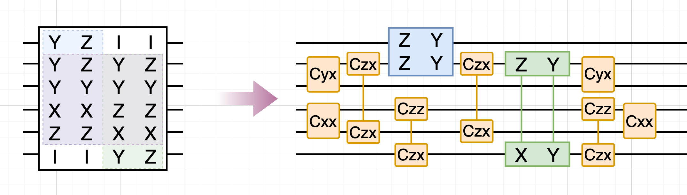

根据`python support_vs_peel_demo.py`运行出的结果，

```
paulis = [
    "IZYZXX",
    "IYYZXY",
    "ZZYXZI",
    "YYYXZI",
]
```
that is,

```
     ┌────┐               ┌───┐┌──────────────┐┌───┐┌──────┐                                          ┌───┐┌──────────────┐┌───┐                                                                                                                                                                       
q_0: ┤ √X ├───────────────┤ X ├┤ Rz(0.012747) ├┤ X ├┤ √Xdg ├──────────────────────────────────────────┤ X ├┤ Rz(0.010947) ├┤ X ├───────────────────────────────────────────────────────────────────────────────────────────────────────────────────────────────────────────────────────────────────────
     ├────┤          ┌───┐└─┬─┘└──────────────┘└─┬─┘└┬───┬─┘┌──────┐                             ┌───┐└─┬─┘└──────────────┘└─┬─┘┌───┐┌────┐                             ┌───┐┌───────────────┐┌───┐┌──────┐                                          ┌───┐┌───────────────┐┌───┐                       
q_1: ┤ √X ├──────────┤ X ├──■────────────────────■───┤ X ├──┤ √Xdg ├─────────────────────────────┤ X ├──■────────────────────■──┤ X ├┤ √X ├─────────────────────────────┤ X ├┤ Rz(0.0077903) ├┤ X ├┤ √Xdg ├──────────────────────────────────────────┤ X ├┤ Rz(0.0073851) ├┤ X ├───────────────────────
     ├────┤     ┌───┐└─┬─┘                           └─┬─┘  └┬───┬─┘┌──────┐┌────┐          ┌───┐└─┬─┘                          └─┬─┘├───┬┘┌──────┐┌────┐          ┌───┐└─┬─┘└───────────────┘└─┬─┘└┬───┬─┘┌──────┐┌────┐                       ┌───┐└─┬─┘└───────────────┘└─┬─┘┌───┐┌──────┐          
q_2: ┤ √X ├─────┤ X ├──■───────────────────────────────■─────┤ X ├──┤ √Xdg ├┤ √X ├──────────┤ X ├──■──────────────────────────────■──┤ X ├─┤ √Xdg ├┤ √X ├──────────┤ X ├──■─────────────────────■───┤ X ├──┤ √Xdg ├┤ √X ├───────────────────────┤ X ├──■─────────────────────■──┤ X ├┤ √Xdg ├──────────
     ├───┬┘┌───┐└─┬─┘                                        └─┬─┘  └┬───┬─┘├───┬┘┌───┐┌───┐└─┬─┘                                    └─┬─┘ └┬───┬─┘├───┬┘     ┌───┐└─┬─┘                            └─┬─┘  └┬───┬─┘└────┘                  ┌───┐└─┬─┘                           └─┬─┘└┬───┬─┘          
q_3: ┤ H ├─┤ X ├──■────────────────────────────────────────────■─────┤ X ├──┤ H ├─┤ H ├┤ X ├──■────────────────────────────────────────■────┤ X ├──┤ H ├──────┤ X ├──■────────────────────────────────■─────┤ X ├──────────────────────────┤ X ├──■───────────────────────────────■───┤ X ├────────────
     └───┘ └─┬─┘                                                     └─┬─┘  └───┘ └───┘└─┬─┘                                                └─┬─┘  ├───┤ ┌───┐└─┬─┘                                         └─┬─┘  ┌───┐  ┌───┐  ┌───┐┌───┐└─┬─┘                                      └─┬─┘  ┌───┐┌───┐
q_4: ────────■─────────────────────────────────────────────────────────■─────────────────■────────────────────────────────────────────────────■────┤ H ├─┤ X ├──■─────────────────────────────────────────────■────┤ X ├──┤ H ├──┤ H ├┤ X ├──■──────────────────────────────────────────■────┤ X ├┤ H ├
     ┌────┐                                                                                                                                        └───┘ └─┬─┘                                                     └─┬─┘ ┌┴───┴─┐├───┤└─┬─┘                                                  └─┬─┘├───┤
q_5: ┤ √X ├────────────────────────────────────────────────────────────────────────────────────────────────────────────────────────────────────────────────■─────────────────────────────────────────────────────────■───┤ √Xdg ├┤ H ├──■──────────────────────────────────────────────────────■──┤ H ├
     └────┘                                                                                                                                              └──────┘└───┘                                                            └───┘
```

↓


```
cxy@(1,2)
cxx@(3,4)
cxz@(0,4)
[ZZ, YY]@(0,1)
czz@(3,5)
cxz@(0,4)
[ZX,YY]@(1,5)
czz@(3,5)
cxx@(3,4)
cxy@(1,2)
```

num2q=12, depth2q=8

that is, 
```
             ┌──────┐┌─────────────────┐               ┌──────┐                                                      
q_0: ────────┤0     ├┤0                ├─■─────────────┤0     ├──────────────────────────────────────────────────────
     ┌──────┐│      ││  Ryy(0.0017272) │ │ZZ(0.010943) │      │┌─────────────────┐┌─────────────────┐┌──────┐        
q_1: ┤0     ├┤      ├┤1                ├─■─────────────┤      ├┤0                ├┤0                ├┤0     ├────────
     │  Cxy ││      │└─────────────────┘               │      ││                 ││                 ││  Cxy │        
q_2: ┤1     ├┤  Cxz ├──────────────────────────────────┤  Cxz ├┤                 ├┤                 ├┤1     ├────────
     ├──────┤│      │      ┌──────┐                    │      ││                 ││                 │├──────┤┌──────┐
q_3: ┤0     ├┤      ├──────┤0     ├────────────────────┤      ├┤  Ryy(0.0097524) ├┤  Rzx(0.0095585) ├┤0     ├┤0     ├
     │  Cxx ││      │      │      │                    │      ││                 ││                 ││      ││  Cxx │
q_4: ┤1     ├┤1     ├──────┤  Czz ├────────────────────┤1     ├┤                 ├┤                 ├┤  Czz ├┤1     ├
     └──────┘└──────┘      │      │                    └──────┘│                 ││                 ││      │└──────┘
q_5: ──────────────────────┤1     ├────────────────────────────┤1                ├┤1                ├┤1     ├────────
                           └──────┘                            └─────────────────┘└─────────────────┘└──────┘        
```


对于这个demonstrative example的编译过程，
请问在现在的grouping=peel的编译通道中是如何一步步变成这种非常简化的样子呢？何时搜索到某个合适的Clifford、何时进行peeling自适应分组等等？

---

# Peel-Forward 编译全过程逐步解析

> 以下基于当前默认引擎(target-descent peel + V2-A ASAP 调度)的实测轨迹
> (`peel_forward(verbose=True)` 逐步复现,与上方电路逐门一致)。
> 约定:脚本对输入串做了 `p[::-1]` 反转,效果是**电路图中的 qubit q 恰好对应
> 原始 Pauli 串的第 q 个字符**,以下全部用此坐标。

## 0. 初始状态:4 行 BSF 表,两个"家族",全部权重 5

| 行 | Pauli 串(位置 0→5) | 支撑 | 权重 |
|---|---|---|---|
| A | `Y Y Y X Z I` | {0,1,2,3,4} | 5 |
| B | `Z Z Y X Z I` | {0,1,2,3,4} | 5 |
| C | `I Y Y Z X Y` | {1,2,3,4,5} | 5 |
| D | `I Z Y Z X X` | {1,2,3,4,5} | 5 |

结构一目了然:{A,B} 与 {C,D} 是两个**支撑不同**的同支撑家族——support
grouping 会把它们分进两个组、各自独立化简、各付各的 Clifford 脚手架。
但注意**跨家族的公共 2-local 子串**:在比特对 (3,4) 上,A、B 的模式是
`X⊗Z`,C、D 的模式是 `Z⊗X`——这正是 support grouping 永远看不见、而
peel 的全表评分能直接捕获的联合优化机会。

## 1. Episode 1 开始:选定 target(无先验分组)

所有行权重打平(全 5),按 1-local 模式流行度平局裁决选中 **A** 作为
target。从此刻起,候选移动被限制在 `supp(A)` 内的比特对上、且必须使
A 的权重严格 −1(终止性证书);**在这些保证进展的候选中,按全表收益
(−ΔW, 受益行数, −受损行数) 排序**——"同时化简"的机会在这里被打分。

## 2. Move 1:`cxx@(3,4)` —— 一步同时化简全部 4 行(ΔW = −4)

比特对 (3,4) 上四行的 2-local 模式:A、B 是 `XZ`,C、D 是 `ZX`。
9 个 CNOT-equiv 选项里 `cxx` 恰好把这两种模式都映到权重 1:

```
A: YYYXZI → YYYIZI     B: ZZYXZI → ZZYIZI     (位置3的X被消去)
C: IYYZXY → IYYZIY     D: IZYZXX → IZYZIX     (位置4的X被消去)
```

全表收益 ΔW=−4、受益 4 行、零受损——评分最高,即使它只被"A 必须降权"
这一证书要求着。**这一步是跨家族共享的实例**:一个 Clifford 同时服务两个
support 组,代价只付一次。四行权重 5→4。

## 3. Move 2:`cxy@(1,2)` —— 又一次 4 行齐降(ΔW = −4)

此时 (1,2) 上的模式:A、C 是 `YY`,B、D 是 `ZY`。`cxy` 同时把两种模式
降到权重 1:

```
A: YYYIZI → YYIIZI     B: ZZYIZI → ZZIIZI
C: IYYZIY → IYIZIY     D: IZYZIX → IZIZIX
```

注意这次的共享配对方式变了(A 与 C 同模式、B 与 D 同模式)——这种
"换搭子"的共享是任何固定分组都无法表达的,只有全息视角能连续吃到。
四行权重 4→3。

## 4. Move 3:`cxz@(0,4)` + **第一次 peeling 自适应分组**

两个家族此时已经分道扬镳:A、B 支撑收缩到 {0,1,4},C、D 到 {1,3,5}。
target A 的支撑内,`cxz@(0,4)` 把 A、B 在 (0,4) 上的 `YZ`/`ZZ` 模式
同时消到位置 0:

```
A: YYIIZI → YYIIII (w=2)     B: ZZIIZI → ZZIIII (w=2)
C、D 不受影响((0,4) 与它们的支撑不相交)
```

A、B 同时落到权重 2 → **立即发射(peel)**:这一刻就是"自适应分组"的
发生时刻——{A, B} 作为一个 cohort 在同一时间位置离开 BSF 表,且因为
残差支撑同为 (0,1),构造器把它们装进**同一个 pending 桶**,KAK 合成为
单个 2q 块 `[ZZ, YY]@(0,1)`(两条旋转共 2 个 CNOT;`{YY, ZZ}` 的
interaction matrix 是 rank-2,c₃=0)。没有任何先验分组:分组=
"被同一段标架同时化简完毕的行"这一事实本身。

## 5. Episode 2:`czz@(3,5)` 收割第二个家族

表中只剩 C、D(权重 3,支撑 {1,3,5})。新 episode 选中 C;
`czz@(3,5)` 把 C 在 (3,5) 的 `ZY` 与 D 的 `ZX` 同时降权:

```
C: IYIZIY → IYIIIY (w=2)     D: IZIZIX → IZIIIX (w=2)
```

两行同落 (1,5) → 第二个 cohort 发射,合成块 `[ZX, YY]@(1,5)`
(同样 rank≤2,2 个 CNOT)。表空,引擎结束。**总计 4 步移动化简全部
4 行**——对照 support grouping:两个组各自独立搜索,移动无法跨组复用。

## 6. 终端标架:replay 尾巴(前向标架的一次性结清)

整个过程 Clifford 只**前向**累积(无逐组镜像)。结束时未结清的标架
`K = czz·cxz·cxy·cxx` 以 replay 形式补在尾部(4 个自逆门倒序:
`czz@(3,5), cxz@(0,4), cxx@(3,4), cxy@(1,2)`)。T=4 很小,replay 即最优
(程序大时 `terminal='auto'` 会切换到全宽度 Clifford 重综合,上界
O(n²/log n) 与 T 无关)。

## 7. V2-A ASAP 调度:深度 8 的由来

发射块与移动按**精确对易偏序**重排(支撑不相交 ⇒ 严格对易):

- `cxx@(3,4)` 与 `cxy@(1,2)` 比特对不相交 → **同层并行**(电路图开头
  两个并排的盒子);
- 前向 `czz@(3,5)` 与块 `[ZZ,YY]@(0,1)` 不相交 → 并行;
- 终端的 `cxz@(0,4)` 与块 `[ZX,YY]@(1,5)` 不相交 → 图中交错排布。

这就是图里各个盒子"犬牙交错"的原因——不是绘图巧合,是调度器构造的
并行层。

## 8. 2q 账本

| 项目 | 2q 门数 |
|---|---|
| 前向移动 ×4(每个 CNOT-equiv = 1) | 4 |
| 块 `[ZZ,YY]@(0,1)`(rank-2 → 2 CNOT) | 2 |
| 块 `[ZX,YY]@(1,5)`(rank-2 → 2 CNOT) | 2 |
| 终端 replay ×4 | 4 |
| **合计** | **12**(depth2q = 8) |

对照(同一程序、同一后处理):**support grouping:num2q=14,
depth2q=12;peel:num2q=12,depth2q=8**。差距全部来自:① move 1、2
的跨家族共享(support 各组重复付);② 前向标架只付一次 + 终端结清,
没有每组镜像;③ ASAP 调度的并行层。

## 9. 时间线总览

```
t=0   4 行 × w5,无分组
t=1   cxx@(3,4)   ΔW=−4(4 行齐降)     ← 跨家族共享 #1
t=2   cxy@(1,2)   ΔW=−4(4 行齐降)     ← 跨家族共享 #2(换搭子)
t=3   cxz@(0,4)   A,B → w2 ┐
      ★ 发射 cohort₁ = {A,B} ┴→ [ZZ,YY]@(0,1)   ← peeling 自适应分组 #1
t=4   czz@(3,5)   C,D → w2 ┐
      ★ 发射 cohort₂ = {C,D} ┴→ [ZX,YY]@(1,5)   ← peeling 自适应分组 #2
end   终端 replay(czz, cxz, cxx, cxy)
      ASAP 调度 → num2q=12, depth2q=8
```

一句话:**Clifford 搜索每一步都在"保证 target 下降"的证书内做全表
联合收益最大化(move 1、2 各一步化简 4 行),而"分组"从未被计算——
它是行被同一段标架共同化简完毕、同时发射、同桶合块这一过程的涌现结果。**
